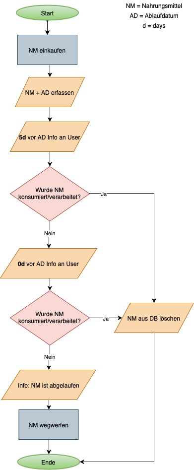
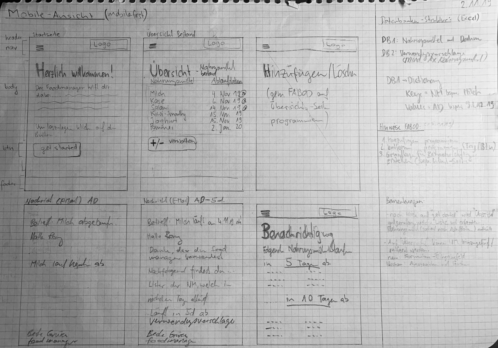

# Projekt "Food-Manager"
# Nahrungsmittelbestand mit Ablaufdatum
DBMVZ18 - HS19 - PROG2 - Rony S. Hanselmann

## Ausgangslage
Die Lebensmittelverschwendung ist nach wie vor ein heiss diskutiertes Thema auf unserem Planeten. Mengenmäßig machen die Lebensmittelabfälle im Haushalt – also die Menge die über Rest- und Biomüll, Kompost und Kanalisation entsorgt werden den größten Teil der Lebensmittelverluste aus. Ursachen sind vor allem mangelnde Einkaufsplanung, kurzfristige Lebensplanung, nicht sachgerechter Lagerung und Haltbarmachung und missverstandenen Mindesthaltbarkeitsangaben.
Im Restmüll sind es insgesamt rund 267.000 Tonnen Lebensmittel im Jahr, wobei Gemüse, Brot und Milchprodukte die „Wegwerfrangliste“ anführen. Dazu kommen noch 90.700 Tonnen Lebensmittelabfälle in der Biotonne. Insgesamt landen somit 357.700 Tonnen Lebensmittel und Speisereste im Müll. In dieser Zahl nicht enthalten sind die Mengen aus Kanalisation, der Eigenkompostierung, und Verfütterung an Haustiere. Die EU-Kommission schätzt, dass auf EU-Ebene 53 % aller weggeworfenen Lebensmittel auf das Konto der privaten Haushalte gehen. In einem durchschnittlichen Haushalt wird ein Viertel der eingekauften Lebensmittel weggeworfen, vieles davon ungeöffnet (Quelle: https://www.muttererde.at/fakten/).

Um im eigenen Haushalt etwas dagegen zu unternehmen, soll die folgende zu programmierende Web-Applikation unterstützend zur Verfügung stehen. 

## Funktion/Projektidee
Sämtliche Nahrungsmittel werden unmittelbar nach dem Kauf erfasst (Dateneingabe). Hierbei stehen die Werte "Nahrungsmittel" und "Ablaufdatum" im Vordergrund. Somit werden die Nahrungsmittel gespeichert (Datenspeicherung). Die Daten können auf der jeweiligen Seite eingesehen werden (Datenausgabe). 5 Tage vor Ablauf bzw. beim Erreichen des Ablaufdatumsder erfassten Nahrungsmittel wird eine Benachrichtigung generiert (Datenausgabe) und dem User mitgeteilt, welches "Nahrungsmittel" in wenigen Tagen das Ablaufdatum erreichen wird. Folgerichtig kann der User entsprechend handeln und das Nahrungsmittel vor dem Ablaufdatum konsumieren.

## Workflow
* Dateneingabe:
Nahrungsmittel sowie Ablaufdatum erfassen

* Datenverarbeitung/-speicherung:
Die vom User erfassten Daten (Nahrungsmittel und Ablaufdaten) werden in einem Dictionary abgespeichert
	
* Datenausgabe:
Erfasste Daten werden auf der "Verwalten"-Seite ausgegeben. Zudem wird bei Erreichen des Ablaufdatums bzw. fünf Tage zuvor eine Benachrichtigung in Form einer E-Mail ausgelöst. 

## Wireframing
Basierend auf vergangenen Projekterfahrungen wurde es dem Projektleiter ein weiteres Mal bestätigt, dass diese Vorab-Visualisierung / Prototyping / Wireframing auf einem Blattpapier der Schlüssel zum Erfolg ist, wenn es darum geht das Projekt in einer Anfangsphase produktiv voranzutreiben.

Folgerichtig wurde nachfolgendes Wireframing durchgeführt und nach und nach ergänzt bzw. adaptiert, bevor die Applikation in der HTML-Sprache (inkl. Einsatz von CSS, Python und Flask) umgesetzt wurde.

## Anmerkungen bzgl. Bewertungskriterien
* Git pushes: Über das gesamte Projekt hinweg wurden regelmässig und schlussendlich über 40 "Git pushes" durchgeführt. Über die Fessttage bzw. den Jahreswechsel (15. Dezember 2019 - 10. Januar 2020) wurde eine Projektauszeit eingelegt. Auch aus jenem Grund, weil der Meilenstein, das Projekt vor Weihnachten grösstenteils fertiggestellt zu haben, erfolgreich erreicht wurde.

* Dokumentation: Als Haupt-Dokumentation dieses Projekts dient diese vorliegende README-Datei (Projektbeschreibung / Grafiken). Detailierte Überlegungen zu Codes sind in den html- und py-Dateien zufinden. Weitere Details über den Hintergrund, Geschichte sowie einen Walkthrough ist auf der Startseite (index.html) der Web-Applikation nachzulesen.

* Datenverarbeitung und Ausgabe: Python, Flask, HTML sowie CSS konnten eroflgreich in der Web-Applikation eingebunden werden. So ergmöglicht es dem User sowohl Daten zu erfassen und zu speichern (unter "Hinzufügen") als auch zu verarbeiten, auszugeben und zu löschen (unter "Verwalten") 

* Originalität und Qualität des Projekts: Durch Bootstrap in Kombination mit dem Einfügen von Bildern (Bitmojis) konnte etwas Farbe bzw. Leben in die Web-Applikation gebracht werden. Die nachfolgende Grafik stellt die Demonstration des erfolgreichen Versendens/Empfangens einer Benachrichtigung dar.

## Diverses
* Web-Browser: Es wird empfohlen, die Web-Applikation mit dem Browser Firefox aufzurufen, da hier beispielsweise die Animation/Darstellung des Kalenders (beim Erfassen der Ablaufdaten) gewährleistet wird.

* Benachrichtigung: Um das automatische Versenden / Empfangen von E-Mail-Benachrichtigungen zu testen, müssen folgende Punkte beachtet werden. 1. "#" auf Zeile 47 entfernen, um Funktion zu aktivieren. 2. E-Mail-Adresse des Empfängers auf Zeile 149 erfassen. 3. In der Datenbank muss mindestens ein Eintrag vorhanden sein, welcher das heutige Datum (oder heute +5d) aufweist. 4. Durch Aufrufen der Startseite wird E-Mail versendet (kann 1-2 Minuten dauern, da Bild vorhanden).

