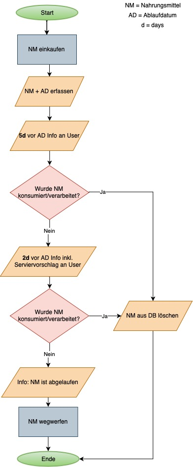

# PROG2-Projekt
# Nahrungsmittelbestand mit Ablaufdatum
DBMVZ18 - PROG2 - HS19 - Rony S. Hanselmann

## Ausgangslage
Die Lebensmittelverschwendung ist nach wie vor ein heiss diskutiertes Thema auf unserem Planeten. Mengenmäßig machen die Lebensmittelabfälle im Haushalt – also die Menge die über Rest- und Biomüll, Kompost und Kanalisation entsorgt werden den größten Teil der Lebensmittelverluste aus. Ursachen sind vor allem mangelnde Einkaufsplanung, kurzfristige Lebensplanung, nicht sachgerechter Lagerung und Haltbarmachung und missverstandenen Mindesthaltbarkeitsangaben.
Im Restmüll sind es insgesamt rund 267.000 Tonnen Lebensmittel im Jahr, wobei Gemüse, Brot und Milchprodukte die „Wegwerfrangliste“ anführen. Dazu kommen noch 90.700 Tonnen Lebensmittelabfälle in der Biotonne. Insgesamt landen somit 357.700 Tonnen Lebensmittel und Speisereste im Müll. In dieser Zahl nicht enthalten sind die Mengen aus Kanalisation, der Eigenkompostierung, und Verfütterung an Haustiere. Die EU-Kommission schätzt, dass auf EU-Ebene 53 % aller weggeworfenen Lebensmittel auf das Konto der privaten Haushalte gehen. In einem durchschnittlichen Haushalt wird ein Viertel der eingekauften Lebensmittel weggeworfen, vieles davon ungeöffnet (Quelle: https://www.muttererde.at/fakten/).

Um im eigenen Haushalt etwas dagegen zu unternehmen, soll die folgende zu programmierende Applikation unterstützend zur Verfügung stehen. 

## Funktion/Projektidee
Sämtliche Nahrungsmittel werden unmittelbar nach dem Kauf erfasst (Dateneingabe). Hierbei stehen die Werte "Nahrungsmittel" und "Ablaufdatum" im Vordergrund. Somit werden die Nahrungsmittel gespeichert (Datenspeicherung). 5 bzw. 2 Tage vor Ablauf der erfassten Nahrungsmittel wird eine Benachrichtigung generiert (Datenausgabe) und dem User mitgeteilt, welches "Nahrungsmittel" in wenigen Tagen das Ablaufdatum erreichen wird. Folgerichtig kann der User entsprechend handeln und das Nahrungsmittel vor dem Ablaufdatum konsumieren. Zudem soll ein Serviervorschlag ausgegeben werden, welcher mindestens 1x das in ablaufende Nahrungsmittel beinhaltet.

## Workflow

* Dateneingabe:
Nahrungsmittel erfassen (evtl. mit Bild), Ablaufdatum erfassen

* Datenverarbeitung/-speicherung:
Die vom User erfassten Nahrungsmittel generieren die erste Datenbank. Eine zweite Datenbank werden die Serviervorschläge bilden (Nahrungsmittel muss mind. 1x enthalten sein).
	
* Datenausgabe:
5 bzw. 2 Tage vor Erreichen des Ablaufdatums wird eine Push-Nachricht/Benachrichtigung (E-Mail/Whatsapp-Nachricht,...) ausgelöst und dem User Serviervorschläge ausgeben.

